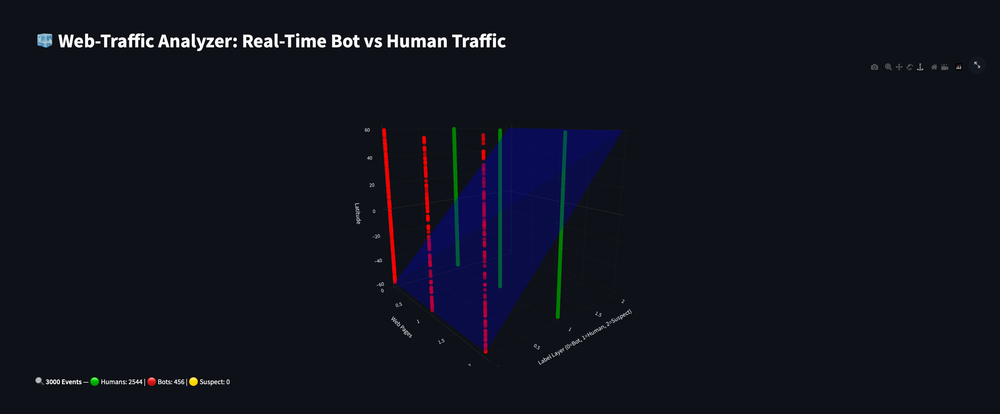

# 🧊 Web-Traffic Analyzer: 3D Real-Time Bot vs Human Visualizer

A real-time web traffic visualizer that classifies incoming traffic as **bot**, **human**, or **suspect**, and maps them within a dynamic **3D cube mesh** simulating website activity. This tool enables engineering, security, and marketing teams to **instantly see traffic patterns** and **identify threats** visually.




---

## 🔍 Project Significance (from a Product Manager's Lens)

Modern websites run thousands of marketing campaigns and attract mixed traffic from organic users, bots, crawlers, and fraud sources. However, **most analytics tools are textual, tabular, or aggregated**—making anomaly detection slow.

**This project solves that.** It enables:

- ✅ **Real-time detection of bot-heavy activity** on specific pages.
- ✅ **Visual clustering of threat vectors** (e.g., bot activity targeting checkout/login pages).
- ✅ **Instant demonstration of campaign hygiene** to stakeholders or clients via 3D cube mesh.
- ✅ **Classification via ML** (Random Forest trained on behavior & user-agent).
  
---


## 🔍 Project Utility

- ### 🏦 AdTech / Campaign Hygiene

- Detect click fraud, bot-driven CPC burn, and fake engagements  
- Visualize ROI-impacting activity live

### 🛒 E-Commerce

- Map bots scraping product pages  
- Detect targeted attacks on `/checkout`, `/login` etc.

### 🏥 Healthcare / Insurance

- Monitor form submissions, spam IPs on pricing calculators  
- Detect abnormal behavioral flows

### 🌐 Cybersecurity

- Act as an interactive **honeypot dashboard**  
- Extend detection to real threat feeds (Cloudflare, Sucuri, etc.)

### 🧠 Future Add-Ons

- Real IP intelligence (via GeoIP)  
- Live map (Mapbox 3D globe mode)  
- User behavior heatmap overlays  
- Admin alert system for bot anomalies  
- Model retraining pipeline from real logs

---

## 📦 Features

- 📊 Real-time traffic intake via simulated POSTs to Flask server
- 🧠 ML-based classification of bot vs human (with fallback heuristic)
- 🧩 3D cube visualization of:
  - X = Page groups
  - Y = Traffic categories (bot/human/suspect)
  - Z = Geolocation slice (latitude)
- 🎨 Color-coded classification (Red = Bot, Green = Human, Yellow = Suspect)
- 🖱️ Hover shows IP, UA, timestamp, and behavior metadata
- 💾 Access logs and classification training from real-world traffic

---

## 🧱 Project Structure

```bash
3d-traffic-visualizer/
├── backend/
│ ├── server.py # Flask + Socket.IO server for traffic
│ ├── classifier.py # ML classifier wrapper
│ └── models/
│ └── traffic_rf.pkl # RandomForest model (optional)
├── simulator/
│ └── traffic_simulator.py # Sends traffic to server every second
├── visualizer/
│ └── app.py # Streamlit-based 3D cube visualizer
├── logs/
│ └── access.log # Traffic logs
├── train_from_log.py # Train RF model from logs
├── requirements.txt
└── README.md # ← You are here
```

---

## 🚀 How to Run

```bash
# Terminal 1 – Start backend
python backend/server.py

# Terminal 2 – Start simulator
python simulator/traffic_simulator.py

# Terminal 3 – Launch dashboard
streamlit run visualizer/app.py

